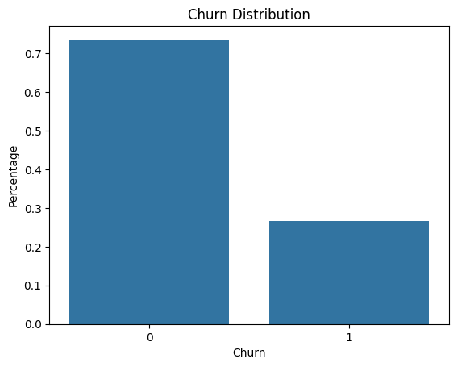
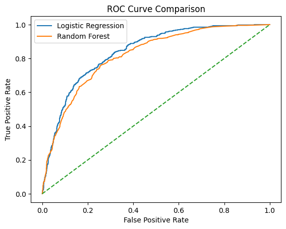
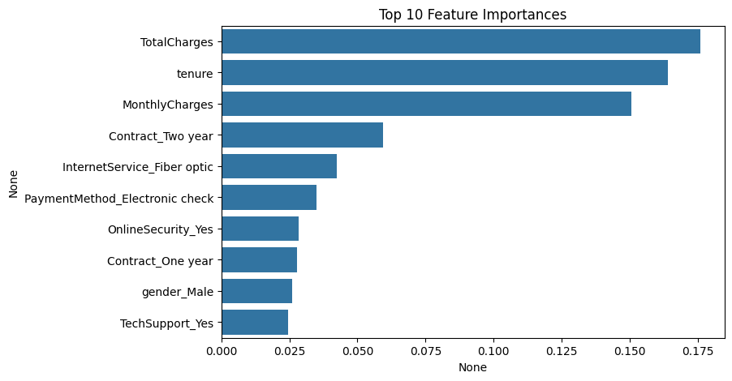

# Telco Customer Churn Prediction

This project focuses on predicting customer churn using the IBM Telco Customer Churn dataset.  
The goal is to identify customers at high risk of leaving and understand the key factors driving churn.

---

## Project Overview

- Business problem: Predict customer churn in a telecom company
- Dataset: IBM Telco Customer Churn (Kaggle)
- Target variable: `Churn`
- Models used:
  - Logistic Regression
  - Random Forest

---

## Project Structure

```text
telco-churn-prediction/
│
├── data/
│   ├── raw/
│   └── processed/
│
├── notebooks/
│   ├── 01_data_preprocessing.ipynb
│   ├── 02_exploratory_data_analysis.ipynb
│   └── 03_modeling_and_evaluation.ipynb
│
├── outputs/
│   └── figures/
│       ├── churn_distribution.png
│       ├── roc_curve.png
│       └── feature_importance.png
│
└── README.md
```

---

## Exploratory Data Analysis

### Churn Distribution

This plot shows the imbalance between churned and non-churned customers.



---

## Modeling

Two machine learning models were trained and evaluated:

- **Logistic Regression** (baseline, interpretable)
- **Random Forest** (non-linear, feature importance)

---

## Model Evaluation

### ROC Curve Comparison

The ROC curves compare model performance in distinguishing churned vs non-churned customers.



---

## ⭐ Feature Importance (Random Forest)

The plot below highlights the most important features influencing churn prediction.



---

## Key Insights

- Contract type and tenure are strong churn predictors
- Customers on month-to-month contracts show higher churn probability
- Ensemble models outperform linear baselines

---

## Tools & Technologies

- Python
- Pandas, NumPy
- Matplotlib, Seaborn
- Scikit-learn
- Jupyter Notebook

---

## Next Steps

- Hyperparameter tuning
- Class imbalance handling (SMOTE)
- Deployment-ready pipeline

---

## Author

**Ilias Tomaras**  
MSc in Information Systems and Services  
Data Scientist

